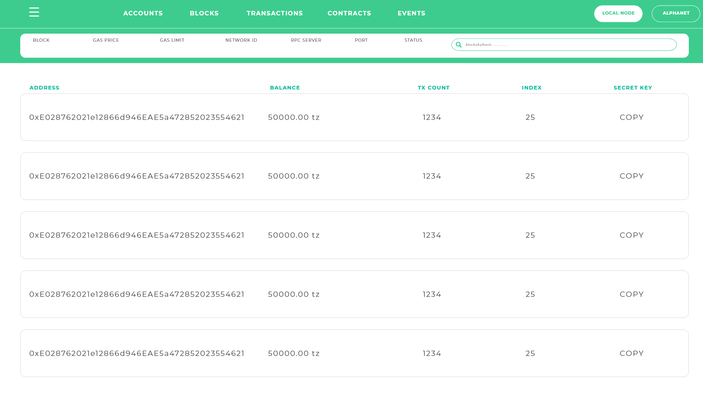

# Tezster
A personal development blockchain based on Javascript that lives entirely on your local machine. It will come as either a CLI or a GUI, has detailed mining controls (allowing you to set gas limits and block time), has log output, and the ability to run transactions or deploy contracts against the state of a live network such as the alphanet and zeronet, without spending any XTZ.

## Getting started

Tezster comes in an npm package with a set of easy commands to kickstart the development or interaction with Tezos. The current beta version will install and start tezos node on your local machine.

### Prerequisites

Latest version of Debian or Ubuntu. Windows users can run debian or ubuntu on

1. Virtual  machine (eg.- VirtualBox)
2. VM instance on cloud (eg.- Google cloud platform or AWS)

### Installing

download the npm package

```
npm install -g tezster-beta@0.0.4 
```

Once it is installed run

```
tezster setup
```
This may take upto 30 mins depending upon the internet connection. It will download and install the Tezos blockchain.
Once it's done, you will get appropriate message. You need to run setup only once. After that run, 

```
tezster start-nodes
```
It will activate Tezos alpha and will give you list of addresses it created. Now you will have two nodes running successfully on port 18731 and 18732. To see the nodes running 
run following command as the root (super user)

```
lsof -i :18731
```
To stop the nodes run

```
tezster stop-nodes
```

### Extra

Coming soon.

```
keep developing
```


