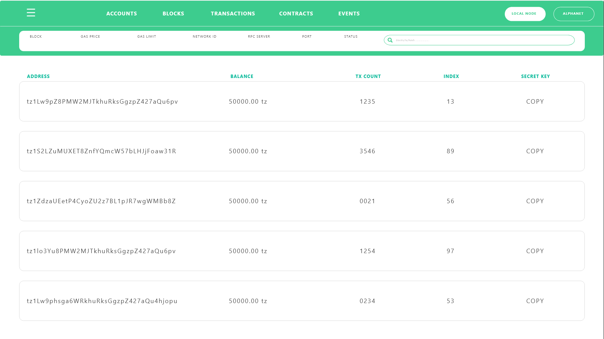

# Tezster
A personal development blockchain based on Javascript that lives entirely on your local machine. It will come as either a CLI with integrated GUI, has log output, and the ability to run transactions or deploy contracts against the local machine node or state of a live network such as the alphanet, without spending any XTZ.

## Getting started

Tezster comes in an npm package with a set of easy commands to kickstart the development or interaction with Tezos. The current version will install and start tezos node on your local machine.

### Prerequisites

Latest version of Debian or Ubuntu. Windows users can run debian or ubuntu on

1. Virtual  machine (eg.- VirtualBox)
2. VM instance on cloud (eg.- Google cloud platform or AWS)

### Installing

download the npm package

```
sudo npm install -g tezster@latest
```

Once it is installed run

```
sudo tezster setup
```
This may take upto 30 mins depending upon the internet connection. It will download and install the Tezos blockchain.
Once it's done, you will get appropriate message. You need to run setup only once. After that run, 

```
sudo tezster start-nodes
```
It will activate Tezos alpha. Now you will have two nodes running successfully on port 18731 and 18732. To see the nodes running 
run following command as the root (super user)

```
sudo lsof -i :18731
```
To stop the nodes run

```
sudo tezster stop-nodes
```
To see generated accounts, run

```
tezster list-accounts
```

To transfer tezos from account to another, run (baking is required only in case of tx happening between localnode accounts)

```
tezster transfer <amount> <from> <to> 
eg. - tezster transfer 10 boottsrap1 bootstrap2

then bake the transaction via,

tezster bake-for bootstrap1 
```
To deploy a smart contract, put the michelson code in  a file (eg.- testcontract.tz)
Code eg.-

```
parameter string;
storage string;
code {CAR; NIL operation; PAIR;};

```
this stores any string to the storage

then run,

```
tezster deploy <contract label> <absolute path> <initial storage value>

eg.- tezster deploy simplecontract /home/op/testcontract.tz "\"helloworld\""

```
if this is successful, you'll receive a contract hash and a message asking you to bake the transaction (assuming you're on local node), then run

```
sudo tezster bake-for bootstrap1

```
To call the contract, run

```
tezster call <contract label> <argument value>
eg.- tezster call simplecontract "\"goodmorning\""

```
After calling, again bake the transaction in the same manner

```
sudo tezster bake-for bootstrap1

```
To see the current storage in a contract, run

```
tezster get-storage <contract-label/address>
eg.- tezster get-storage simplecontract

```
You can call this after each step when you deploy or call contract to see the updated storage.
if you're on localhost, storage will change only after the deploy/call operation is baked by user manually.
on alphanet node, user may have to wait before operation is baked and included in a block.

To see what you can do with tezster, run

```
tezster --help
```

### Extra

Coming soon.

```
keep developing
```


